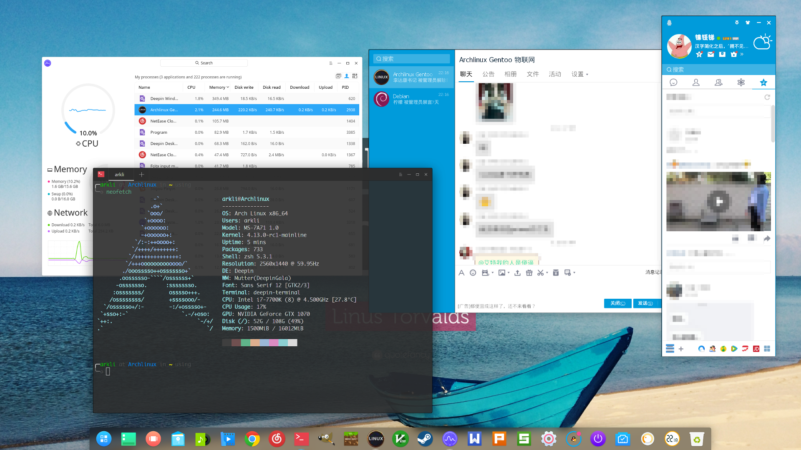
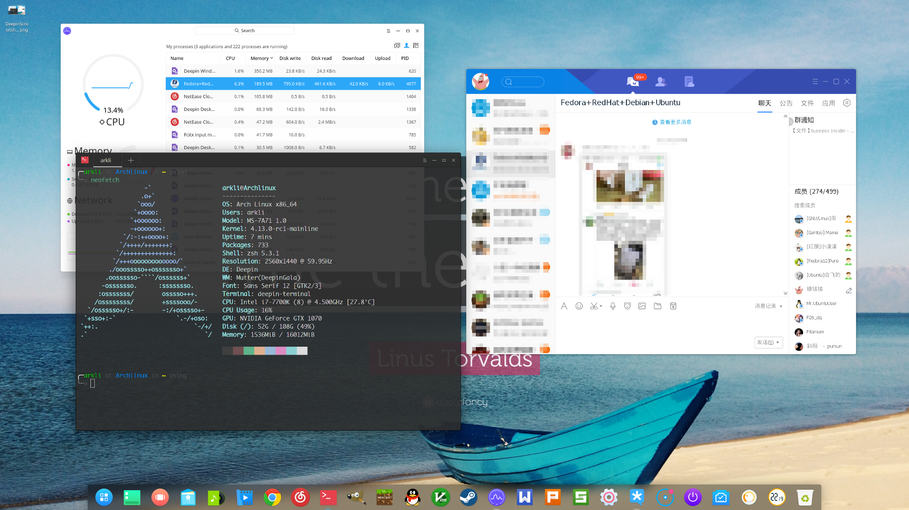

已经打包好的，可以直接使用：https://pan.baidu.com/s/1c2KozAw 提取码fin6
也可以自行打包安装，脚本已经有人传到AUR里了，所以也可以从AUR安装
首先肯定要装32位驱动(记得打开32位源)
可以只sudo pacman -S lib32-alsa-lib lib32-fontconfig lib32-mesa

其次安装deepin-wine，用sudo pacman -U安装
其中deepin-wine deepin-wine32 deepin-wine-helper deepin-fonts-wine deepin-libwine deepin-wine-uninstaller deepin-udis86都是要的
udis86不要用AUR里的那个，这里已经给出安装包

然后选择qq或tim（可以都装）安装

对于2k高分屏如需进行缩放：WINEPREFIX=~/.deepinwine/Deepin-QQ deepin-wine winecfg
在Graphics里改成120dpi

可以记录密码，可以自动登录！运行效果和deepin上一样，稳定性还是可以的

经测试大多数桌面环境都可完美运行，dde，xfce，gnome，openbox，awesome都没什么问题，唯独kde有些小问题，这个可能是deepin-wine本身的问题

(重要)如果使用TIM经常用一会就闪退的话，因该是~/.deepinwine/Deepin-TIM/drive_c/windows/system32/msls31.dll这东西的锅，据说bug已经修复了。。。还是有问题的话就从网上下个msls31.dll然后覆盖掉

PS：完全搬运自deepin，这里只是打了个包
=======
